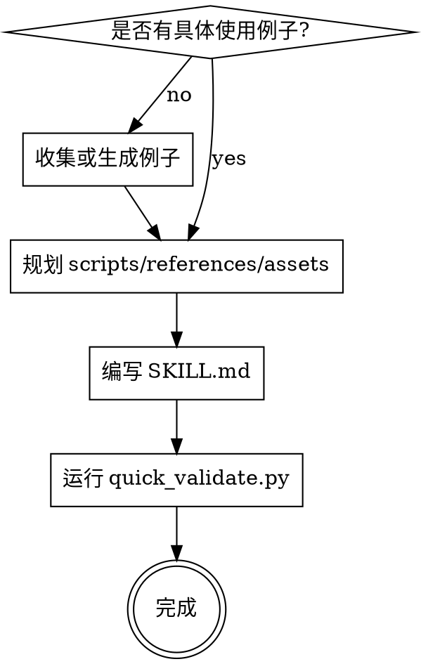

# AI Agent 的 Skill 系统设计

## 一句话概括

这篇文章把 Skill 定义为 Agent 的“小而准行为系统”，强调触发、加载、资源分层、门控、前向测试和平台适配共同决定 Skill 是否真的能改变 Agent 行为。

## 实践内容

原文给出的标准 Skill 目录与 `SKILL.md` 分工：

```text
skill-name/
SKILL.md
agents/
openai.yaml
scripts/
references/
assets/
```

```yaml
---
name: create-skill
description: 用于创建或更新包含工作流、工具集成、领域知识、脚本、参考资料或资产的 Agent Skill。
---
# 创建 Skill
流程：
1.理解具体示例。
2.规划可复用资源。
3.初始化 Skill。
4.编辑 SKILL.md 和相关资源。
5.验证。
6.结合真实使用持续迭代。
```

原文把资源拆成三类：同一段代码会被反复重写、或任务需要确定性时放进 `scripts/`；执行时需要查阅但不必每次读的知识放进 `references/`；不会被读入上下文、而是作为输出材料被复制、修改或引用的文件放进 `assets/`。

```text
pdf-editor/
SKILL.md
scripts/
rotate_pdf.py

big-query/
SKILL.md
references/
schema.md
finance.md
product.md

frontend-webapp-builder/
SKILL.md
assets/
hello-world/
```

低自由度任务需要硬门控：

```xml
<HARD-GATE>
在理解具体使用示例并规划好可复用资源之前，不要创建或编辑该 Skill。
</HARD-GATE>
```

复杂流程适合用 GraphViz DOT 外化：



验证命令与测试方式：

```bash
scripts/init_skill.py my-skill --path "${CODEX_HOME:-$HOME/.codex}/skills"
scripts/init_skill.py my-skill --path "${CODEX_HOME:-$HOME/.codex}/skills" --resources scripts,references
scripts/quick_validate.py <path/to/skill-folder>
```

```text
使用位于 /path/to/skill-x的@skill-x来解决问题 y。
```

原文给出 description 的反例和更好写法：

```text
description:"创建 Skill 时先收集例子，再规划 scripts/references/assets，然后运行 init_skill.py，最后 quick_validate.py。"
```

```text
description:"用于创建或更新包含专用工作流、工具集成、领域知识、捆绑脚本、参考资料、资产、验证或迭代机制的 Agent Skill。"
```

平台适配应以行为规则为核心，再映射具体工具：

```text
- TodoWrite -> todowrite
- Task tool -> @mention subagent system
- Skill tool -> native skill tool
```

## 摘录

> Skill 面向的是 Agent，它会在上下文不足、任务复杂、目标冲突或执行压力下走捷径。因此，Skill 必须预设这些失败模式，并把正确路径写成更容易被执行的行为结构。因此，Skill 不是把人类已经知道的背景知识完整搬进去，而是补充 Agent 完成任务时缺少的程序性知识、资源边界和验证方式。换句话说，写 Skill 不是“把说明写清楚”，而是“让 Agent 在复杂环境中更难走错”。

> 核心的提醒是：Skill 要简洁、分层、可验证、可迭代。上下文窗口是公共资源，SKILL.md只放核心流程；脚本承接确定性，引用承接领域知识，资产承接输出材料；复杂 Skill 要通过真实任务前向测试，而不是靠作者自信。因此，Skill 是 Agent 行为设计的一种工程方法。它把触发、加载、执行、约束、验证和迭代组织在一起，让通用 Agent 在特定任务上获得更稳定的专业行为。

## 涉及实体

- [[Agent-Skill]] —— 文章的核心对象，强调 Skill 是能力包和行为系统。
- [[Harness-Engineering]] —— 门控、脚本、验证和平台适配把 Skill 推向 Harness 层。
- [[Progressive-Disclosure]] —— 元数据、正文、资源三层加载就是渐进式披露。
- [[Token成本控制]] —— 文章反复强调上下文窗口是公共资源，Skill 内容必须按预算组织。

## 涉及主题

- [[AI-Skill体系-主题]]
- [[Skill开发最佳实践]]

## 我的评注

这篇的价值在于把“写 Skill”从写作任务改写成行为设计任务：description 是发现层，不是教程；`SKILL.md` 是执行层，不是知识仓库；脚本、引用和资产分别承接确定性、知识和输出材料。它也补上了一个常被忽略的点：测试 Skill 时不能把诊断和答案泄露给子代理，否则测到的是“被提示后的成功”，不是 Skill 本身的可用性。
